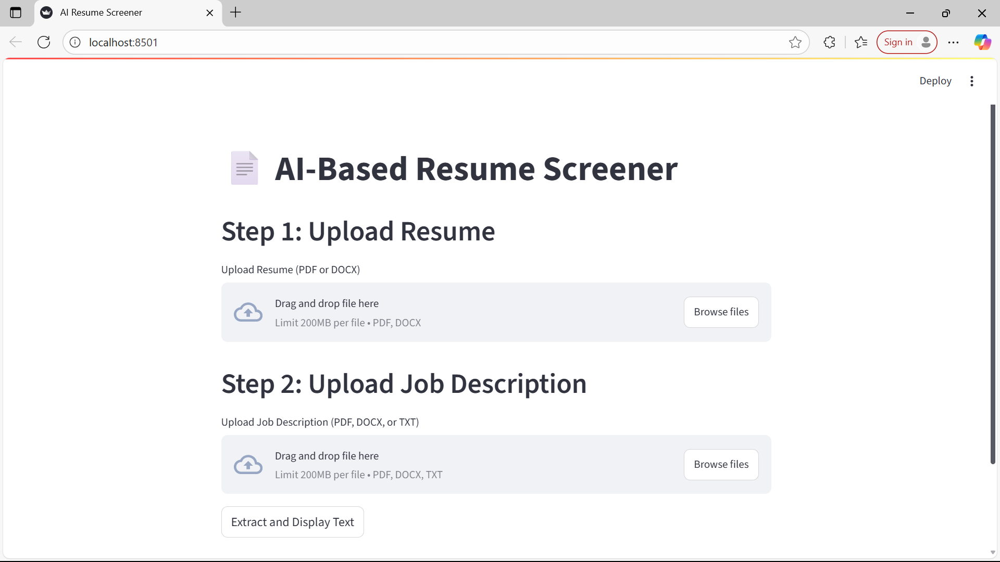
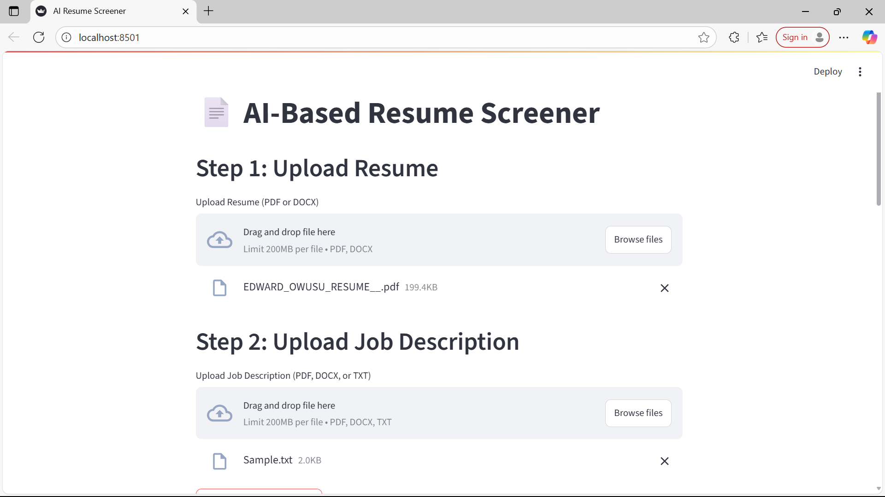
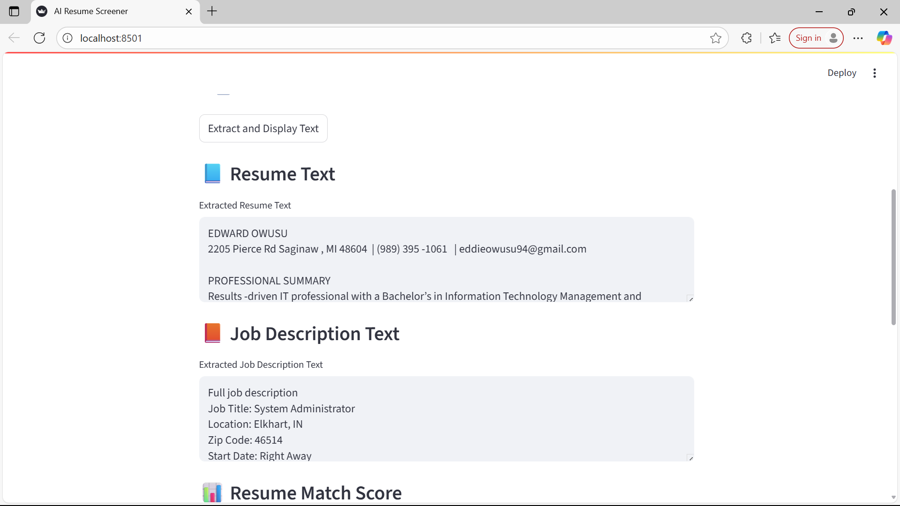
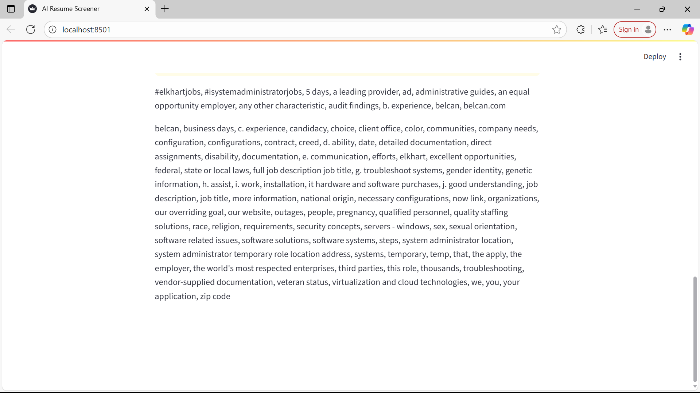
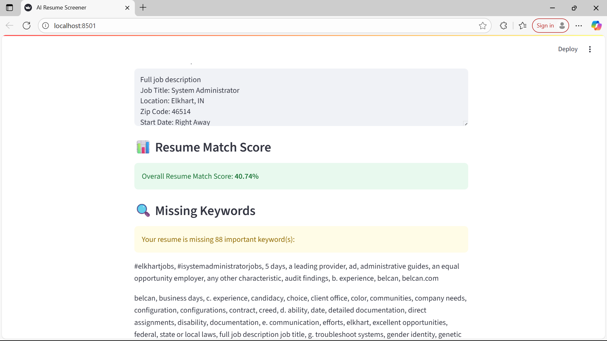

# 📄 AI-Based Resume Screener

An AI-powered web app that automatically evaluates resumes against job descriptions using natural language processing. Built with Python and Streamlit, this tool helps job seekers improve their resumes and helps employers quickly assess candidate-job fit.


🔗 [Live Demo on Streamlit](https://ai-resume-screener-2ergge6n3y4fercyvqdja5.streamlit.app/)

> 🔗 GitHub: [Edward-Owusu/AI-Resume-Screener](https://github.com/Edward-Owusu/AI-Resume-Screener)

---

## 🚀 Features

- 📤 Upload resumes (PDF or DOCX)
- 📄 Upload job descriptions (PDF, DOCX, or TXT)
- 🧠 Extracts and compares text intelligently using NLP
- 📊 Calculates a **match score** (0–100%) using TF-IDF + cosine similarity
- 🔍 Highlights **missing keywords**
- 📥 Generates a **downloadable feedback report**
- 💻 Clean, interactive UI using **Streamlit**

---

## 🧠 Technologies Used

- **Python 3.11+**
- [Streamlit](https://streamlit.io/)
- [spaCy](https://spacy.io/)
- [scikit-learn](https://scikit-learn.org/)
- `PyPDF2`, `python-docx`

---

## 📂 Project Structure

AI-Resume-Screener/
│
├── app.py # Main Streamlit app
├── resume_parser.py # Resume text extraction
├── job_parser.py # Job description parser
├── similarity.py # Keyword scoring + missing term analysis
├── uploads/ # Folder for uploaded files
├── README.md # Project overview and usage
└── requirements.txt # Python dependencies


---

## ▶️ How to Run the App Locally

### 1. Clone this repository
```bash
git clone https://github.com/Edward-Owusu/AI-Resume-Screener.git
cd AI-Resume-Screener

2. Install dependencies
pip install -r requirements.txt
python -m spacy download en_core_web_sm

3. Launch the Streamlit app
streamlit run app.py
Then open your browser and visit: http://localhost:8501

📥 Output
✅ Extracted resume & job description text
📊 Resume match score
🔍 Missing keywords list
📁 Downloadable feedback report (TXT)


📸 Screenshots
## 📸 Screenshots

Below is a preview of the Resume Screener app in action:

### 🖼️ Home Page & Upload Interface


### 🧠 Resume & JD Text Displayed


### 📊 Resume Match Score & Missing Keywords


### 📥 Downloadable Feedback Report


### ✅ Full Interface Overview



👤 Author
Edward Owusu
AI & Software Developer
GitHub

📄 License
This project is licensed under the MIT License.

If you found this project helpful, consider starring ⭐ the repo or sharing it with others!

